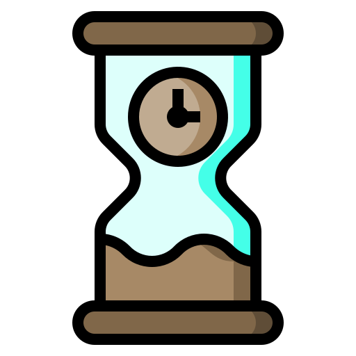

<!----- FORKS - STARTS ----->

  
[![Forks][forks-shield]][forks-url]
[![Stargazers][stars-shield]][stars-url]
[![MIT License][license-shield]][license-url]

<!----- LOGO INICIAL ----->

 

  

  <h3 align="center">Dark-Booster</h3>

  

    Dark-Booster ajuda você com a suas horas na steam
     
     
    <a href="https://github.com/0DarkMode0?tab=repositories"><strong>Meus Projetos</strong></a>
  

<!----- INICIO PROJETO ----->

##

![Product Name Screen Shot][product-screenshot]

<a href="https://github.com/0DarkMode0/Pinger/releases/download/Dark/Pinger.bat"><strong>[ Download ]</strong></a>

Dark-Booster é um programa que ajuda você dando um boost na suas horas jogadas na steam.

 
Ferramentas:

* Booster de horas
* Custom ID

<!-- MARKDOWN LINKS & IMAGES -->
[forks-shield]: https://img.shields.io/github/forks/0DarkMode0/Dark-Booster.svg?style=for-the-badge
[forks-url]: https://github.com/0DarkMode0/Dark-Booster/network/members
[stars-shield]: https://img.shields.io/github/stars/0DarkMode0/Dark-Booster.svg?style=for-the-badge
[stars-url]: https://github.com/0DarkMode0/Dark-Booster/stargazers
[license-shield]: https://img.shields.io/github/license/0DarkMode0/Dark-Booster.svg?style=for-the-badge
[license-url]: https://github.com/0DarkMode0/Dark-Booster/blob/master/LICENSE.txt
[product-screenshot]: imagens/projeto.png
